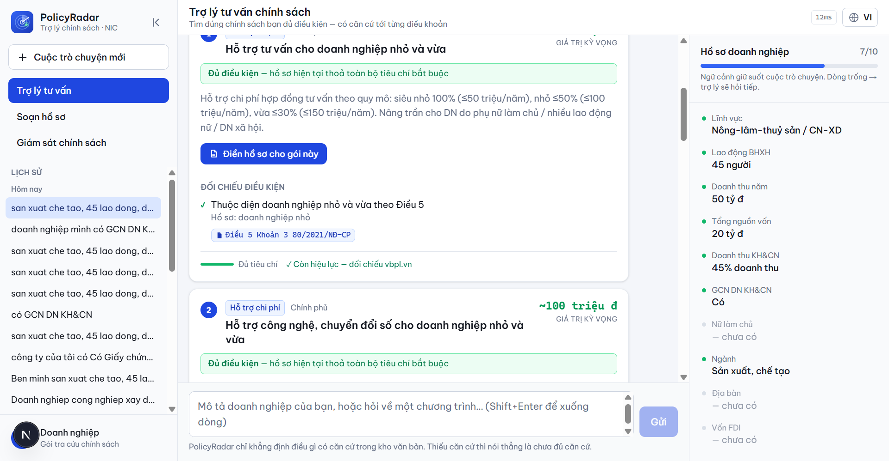
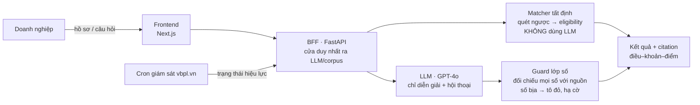
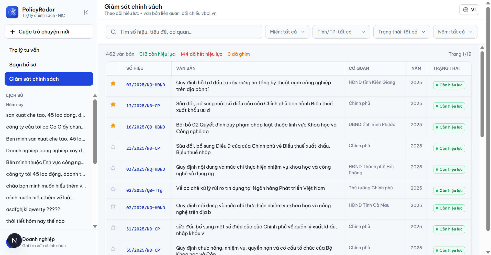

# PolicyRadar

[](https://github.com/Clownnvd/vaic-2026/actions/workflows/test.yml)
[](https://vaic-2026-production.up.railway.app)


> VAIC 2026 · Track **Đổi mới Sáng tạo** · Đề **Policy & Grant Navigator** (National Innovation Center)

**Trợ lý chủ động hỏi hồ sơ doanh nghiệp rồi trả về danh sách chính sách ưu đãi / quỹ hỗ trợ mà doanh nghiệp ĐỦ ĐIỀU KIỆN — mọi kết luận đủ/chưa đủ điều kiện đều trích tới điều–khoản–điểm, và có một lớp guard tất định chống LLM bịa số.**



**Mục lục:** [Bản LIVE](#-bản-chạy-live) · [Vấn đề](#vấn-đề) · [Giải pháp](#giải-pháp--matcher-chạy-ngược) · [Kiến trúc](#kiến-trúc--llm-sinh-lớp-tất-định-gác) · [Tính năng](#tính-năng-chính) · [Chống bịa](#chống-bịa--đo-được-không-hứa-suông) · [Tech stack](#tech-stack) · [Dữ liệu](#dữ-liệu--ghi-công) · [Chạy local](#chạy-local) · [Giới hạn](#giới-hạn-thành-thật-không-giấu)

## 🔗 Bản chạy LIVE

| | URL | Kiểm nhanh |
|---|---|---|
| **Ứng dụng** | https://vaic-2026-production.up.railway.app | mở là dùng ngay |
| **API (BFF)** | https://web-production-db4aa.up.railway.app/health | trả `{"ok":true,"service":"policyradar-bff","so_chuong_trinh":7}` |

Hai service chạy trên Railway từ repo public. Chi tiết deploy: **[DEPLOY.md](DEPLOY.md)**.

---

## Vấn đề

Startup, doanh nghiệp FDI và công nghệ cao ở Việt Nam **bỏ lỡ hàng nghìn chính sách ưu đãi và quỹ hỗ trợ mà họ đủ điều kiện** — chỉ vì không biết những chương trình đó tồn tại để mà tìm. Kho pháp luật quốc gia trên vbpl.vn có tới ~**158.822 văn bản** *(theo vbpl.vn, 07/2026)*, sửa đổi và hết hiệu lực liên tục, rải rác nhiều bộ ngành. Hỏi một trợ lý AI thông thường thì nó **bịa ra nghị định không có thật** → doanh nghiệp nộp sai, mất cơ hội, gánh rủi ro pháp lý. Với chính sách, **một con số bịa = một hồ sơ nộp sai.**

## Giải pháp — matcher chạy NGƯỢC

Chatbot chỉ trả lời khi người ta **đã biết câu hỏi**. PolicyRadar chạy ngược lại:

```
Hồ sơ doanh nghiệp  ──►  QUÉT NGƯỢC điều kiện thụ hưởng  ──►  Danh sách gói ĐỦ ĐIỀU KIỆN
(lĩnh vực, doanh thu,     (đối chiếu tất định, không LLM)      (xếp theo giá trị kỳ vọng,
 lao động BHXH, vốn,                                            kèm trích dẫn điều–khoản,
 % doanh thu KH&CN,                                             trạng thái hiệu lực, hạn nộp)
 GCN KH&CN, địa bàn…)
```

Chỉ cần khai **một tiêu chí** (ví dụ "có Giấy chứng nhận DN KH&CN") là đã ra được các gói trong tầm với. Matcher **chủ động cho doanh nghiệp biết họ đủ điều kiện gì**, thay vì đợi họ biết mà hỏi.

## Kiến trúc — LLM sinh, lớp tất định gác

Nguyên tắc: **việc nào cần chính xác pháp lý thì CODE làm; việc nào cần ngôn ngữ tự nhiên thì LLM làm — và LLM luôn bị một lớp tất định kiểm lại.**



- **Matcher (tất định)** quyết định *đủ / chưa đủ / gần đạt* — không để LLM phán. Mỗi điều kiện có citation riêng.
- **LLM (GPT-4o)** chỉ lo hội thoại + diễn giải luật bằng lời; **bị cấm** kết luận eligibility hay sinh số.
- **Guard** đối chiếu mọi con số LLM sinh với nguồn: số không có căn cứ bị tô đỏ + hạ cờ "chưa đủ căn cứ".

## Tính năng chính

1. **Matcher chạy ngược** — nhập hồ sơ → ra gói đủ điều kiện, xếp theo giá trị kỳ vọng, nêu **đích danh** điều kiện còn thiếu.
2. **3 trạng thái tất định** — *Đủ điều kiện · Chưa đủ · Gần đạt* (thiếu tin thì HỎI, không đoán). Gần đạt kèm "cần bổ sung gì để lên đủ".
3. **Citation tới điều–khoản–điểm** — bấm mở nguyên văn trích dẫn + link vbpl.vn.
4. **Guard chống bịa (lớp số)** — số/định danh LLM bịa bị **tô đỏ + hạ cờ "chưa đủ căn cứ"** ngay khi sinh (lớp số mù ngữ nghĩa — chỉ bắt số/định danh).
5. **Giám sát hiệu lực** (mắt xích ② của đề) — đối chiếu vbpl.vn, phát hiện văn bản hết hiệu lực, lọc theo **Miền/Tỉnh**, ghim văn bản quan tâm.
6. **Soạn hồ sơ** — từ thẻ gói bấm "Điền hồ sơ" → mở form đúng gói, **điền sẵn phần biết chắc từ hồ sơ DN**, doanh nghiệp tự khai phần còn thiếu; lưu nháp + tải file.
7. **Chịu được gõ KHÔNG DẤU** + i18n VI/EN.



## Chống bịa — đo được, không hứa suông

Trong lĩnh vực pháp lý, một chatbot bịa 1 nghị định là mất toàn bộ niềm tin. Đây là rào cản cốt lõi — và chúng tôi **công bố số thật, kể cả số xấu**:

| Lớp guard | Đo trên | Kết quả | Trạng thái |
|---|---|---|---|
| **Lớp SỐ tất định** | 150 output THẬT của GPT-4o | GPT bịa **7** số/định danh → rule bắt **7/7**, lọt **0** | ✅ **chạy LIVE** trong `/chat` (chỉ bắt số/định danh) |
| **PhoBERT NLI (ngữ nghĩa)** | tập tự sinh (in-domain) | F1 = **0.975** | ⚠️ train xong, **chưa nối live** |
| PhoBERT NLI | ViFactCheck (out-of-distribution, zero-shot) | acc = **0.395** (yếu) | 📉 **công bố thẳng, không giấu** |

Chúng tôi **không khoe F1 0.975 mà giấu số OOD 0.395**. Lớp gác load-bearing thật là **lớp số tất định** (không để lọt số bịa nào trên 150 output GPT-4o thật); lớp ngữ nghĩa neural còn yếu ngoài phân phối và **được nói rõ**. Đúng tinh thần: *thiếu căn cứ thì nói thẳng.*

Nền chống-bịa còn ở **tầng dữ liệu**: 7 gói trong kho được **chép NGUYÊN VĂN** từ corpus kèm `doc_id` truy nguồn (giữ cả lỗi chính tả nguồn), đã qua **kiểm chứng đối kháng — 0/7 gói bịa**. File `matcher/kho_mau.py` còn tự ghi lại những chỗ bản cũ từng bịa (ví dụ "chi R&D ≥ 1%" — điều kiện KHÔNG tồn tại trong văn bản, đã gỡ).

## Tech stack

| Lớp | Công nghệ |
|---|---|
| Frontend | Next.js 16 · React 19 · Tailwind v4 · pnpm |
| BFF | FastAPI · uvicorn · pyarrow · openai (GPT-4o) |
| Lõi tất định | `matcher/` (Python thuần — eligibility) · `guard/` (lớp số + PhoBERT NLI) |
| Dữ liệu | corpus vbpl.vn — 2.669 VB (metadata parquet nén; toàn văn verbatim ở kho 7 gói) · cache trạng thái hiệu lực |
| Hạ tầng | Railway (2 service) · GitHub Actions (CI) |

## Dữ liệu & ghi công

Văn bản pháp luật lấy từ bộ **`tmquan/vbpl-vn`** (HuggingFace), nguồn gốc **vbpl.vn — Cơ sở dữ liệu quốc gia về văn bản pháp luật (Bộ Tư pháp)**, license **CC-BY-4.0** (CC-**BY** = bắt buộc ghi công).

Đội **không dùng nguyên dump**: lọc còn **9.436 văn bản** (chạm từ khoá chính sách ∧ 5 loại văn bản ∧ năm ≥ 2018), **tự viết parser Điều→Khoản→Điểm**, lọc chủ đề doanh nghiệp còn **2.669 văn bản**. Đã **rà nội dung nhạy cảm** (5 phạm vi Điều 6 thể lệ) và chủ động loại 1 văn bản khỏi phạm vi tra cứu. Giám sát hiệu lực: **949 văn bản** đã đối chiếu vbpl.vn (598 còn / 290 hết hẳn / 60 hết một phần / 1 chưa có hiệu lực).

Chi tiết + license thư viện: **[docs/NGUON-DU-LIEU.md](docs/NGUON-DU-LIEU.md)**.

## Cấu trúc thư mục

```
frontend/   Next.js — chat, thẻ gói 3 trạng thái, tab Soạn hồ sơ / Giám sát
bff/        FastAPI — cửa duy nhất ra LLM/corpus; dien_giai (guard số live)
matcher/    LỚP TẤT ĐỊNH — quét ngược eligibility; kho_mau (7 gói verbatim)
guard/      chống bịa — lớp số (vn_number) + PhoBERT NLI + "4 đòn" eval
corpus/     parser Điều→Khoản→Điểm; index tra cứu
ho_so/      dựng bộ biểu mẫu + điền sẵn từ hồ sơ DN
gateway/    1 cửa gọi LLM — audit log + fallback đa-model
data/       corpus_slim (metadata) + cache giám sát hiệu lực
docs/       NGUON-DU-LIEU · GUARD-4-DON · LO-TRINH-PILOT · MO-HINH-KINH-DOANH
scripts/    script vận hành (cron giám sát, curate…) · scripts/dev/ (thí nghiệm)
```

## Chạy local

```bash
# BFF (cần Python 3.11)
pip install -r requirements.txt
USE_LLM=0 uvicorn bff.main:app --port 8000      # USE_LLM=0 = rule mode, không cần key

# Frontend (cần Node + pnpm)
cd frontend && pnpm install && pnpm dev          # mở http://localhost:3002
```

Đặt `OPENAI_API_KEY` (+ `USE_LLM=1`) để bật diễn giải GPT-4o + guard số live. Không có key vẫn chạy đầy đủ lõi tất định.

## Test & CI

```bash
python matcher/test_match.py      # matcher tất định (citation verbatim, chống gật bừa)
python guard/test_vn_number.py    # lớp số bắt bịa đơn vị (20 triệu ≠ 20 tỷ)
```

CI GitHub Actions chạy **10 bộ test tất định offline** mỗi push (badge ở đầu README).

## Mô hình kinh doanh & lộ trình

Hai đường: **B2G qua NIC** (nhà nước tài trợ, DN dùng free) + **SaaS freemium** (thu ở soạn hồ sơ + giám sát cảnh báo). Số thị trường + đối thủ có nguồn thật. Chi tiết:
**[docs/MO-HINH-KINH-DOANH.md](docs/MO-HINH-KINH-DOANH.md)** · **[docs/LO-TRINH-PILOT.md](docs/LO-TRINH-PILOT.md)**.

## Giới hạn thành thật (không giấu)

- **Kho 7 gói** (cấp trung ương, curate tay) — nền vững để mở rộng, chưa phủ toàn bộ chính sách; "63 tỉnh" ở Giám sát là **thẻ địa lý trên corpus**, chưa phải gói ưu đãi cấp tỉnh.
- **Lớp NLI ngữ nghĩa chưa nối live** — mới chặn số + kiểm tồn tại citation; guard live là lớp số tất định.
- **Giám sát** là cron hằng ngày, không real-time.
- **Chưa có tín hiệu cầu đo được** (LOI/khảo sát) — mọi đơn giá trong doc KD là giả định, cần validate ở pilot.

## Tài liệu

[DEPLOY.md](DEPLOY.md) · [docs/NGUON-DU-LIEU.md](docs/NGUON-DU-LIEU.md) · [docs/GUARD-4-DON.md](docs/GUARD-4-DON.md) · [docs/LO-TRINH-PILOT.md](docs/LO-TRINH-PILOT.md) · [docs/MO-HINH-KINH-DOANH.md](docs/MO-HINH-KINH-DOANH.md)
