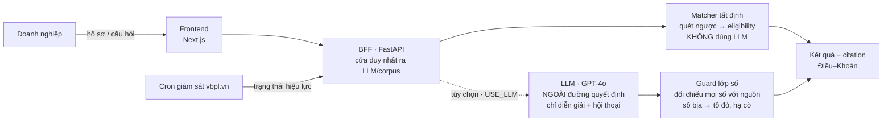

# PolicyRadar

[](https://github.com/Clownnvd/vaic-2026/actions/workflows/test.yml)
[](https://vaic-2026-production.up.railway.app)


> VAIC 2026 · Track **Đổi mới Sáng tạo** · Đề **Policy & Grant Navigator** (National Innovation Center) · Đội **kingpro**
> Badge test = **10 bộ test tất định offline**, chạy lại được ngay trên thư mục nộp (xem [Test & CI](#test--ci)) — không phụ thuộc trạng thái GitHub.

**Trợ lý chủ động hỏi hồ sơ doanh nghiệp rồi trả về danh sách chính sách ưu đãi / quỹ hỗ trợ mà doanh nghiệp ĐỦ ĐIỀU KIỆN — mọi kết luận đủ/chưa đủ điều kiện đều trích tới Điều–Khoản (kèm nguyên văn, có điểm a/b/c bên trong), và có một lớp guard tất định chống LLM bịa số.**


**Mục lục:** [Bản LIVE](#-bản-chạy-live) · [Vấn đề](#vấn-đề) · [Giải pháp](#giải-pháp--matcher-chạy-ngược) · [Kiến trúc](#kiến-trúc--llm-sinh-lớp-tất-định-gác) · [Điểm vào code](#điểm-vào-code) · [Tính năng](#tính-năng-chính) · [Chống bịa](#chống-bịa--đo-được-không-hứa-suông) · [Kịch bản demo](#kịch-bản-demo-2-phút) · [Tech stack](#tech-stack) · [Dữ liệu](#dữ-liệu--ghi-công) · [Chạy local](#chạy-local) · [Giới hạn](#giới-hạn-thành-thật-không-giấu) · [Đội & liên hệ](#đội--liên-hệ)

## 🔗 Bản chạy LIVE

| | URL | Kiểm nhanh |
|---|---|---|
| **Ứng dụng** | https://vaic-2026-production.up.railway.app | mở là dùng ngay |
| **API (BFF)** | https://web-production-db4aa.up.railway.app/health | trả `{"ok":true,"service":"policyradar-bff","so_chuong_trinh":7}` |

Hai service chạy trên Railway từ repo public. Chi tiết deploy: **[DEPLOY.md](DEPLOY.md)**.

---

## Vấn đề

**Startup, doanh nghiệp nhỏ và vừa, doanh nghiệp công nghệ cao và FDI ở Việt Nam** đang **bỏ lỡ nhiều chính sách ưu đãi và quỹ hỗ trợ mà họ ĐỦ ĐIỀU KIỆN** — chỉ vì không biết những chương trình đó tồn tại để mà tìm. Kho pháp luật quốc gia **do Chính phủ Việt Nam quản lý** (vbpl.vn — Cơ sở dữ liệu quốc gia về văn bản pháp luật, Bộ Tư pháp) có **hàng trăm nghìn văn bản**, sửa đổi và hết hiệu lực liên tục, rải rác nhiều bộ ngành (phễu dữ liệu cụ thể ở mục [Dữ liệu](#dữ-liệu--ghi-công)). Hỏi một trợ lý AI thông thường thì nó **bịa ra nghị định không có thật** → doanh nghiệp nộp sai, mất cơ hội, gánh rủi ro pháp lý. Với chính sách, **một con số bịa = một hồ sơ nộp sai.**

## Giải pháp — matcher chạy NGƯỢC

Chatbot chỉ trả lời khi người ta **đã biết câu hỏi**. PolicyRadar chạy ngược lại:

```
Hồ sơ doanh nghiệp  ──►  QUÉT NGƯỢC điều kiện thụ hưởng  ──►  Danh sách gói ĐỦ ĐIỀU KIỆN
(lĩnh vực, doanh thu,     (đối chiếu tất định, không LLM)      (xếp theo giá trị kỳ vọng,
 lao động BHXH, vốn,                                            kèm trích dẫn Điều–Khoản,
 % doanh thu KH&CN,                                             trạng thái hiệu lực, hạn nộp)
 GCN KH&CN, địa bàn…)
```

Chỉ cần khai **một tiêu chí** (ví dụ "có Giấy chứng nhận DN KH&CN") là đã ra được các gói trong tầm với. Matcher **chủ động cho doanh nghiệp biết họ đủ điều kiện gì**, thay vì đợi họ biết mà hỏi.

## Kiến trúc — LLM sinh, lớp tất định gác

Nguyên tắc: **việc nào cần chính xác pháp lý thì CODE làm; việc nào cần ngôn ngữ tự nhiên thì LLM làm — và LLM luôn bị một lớp tất định kiểm lại.** LLM là **tùy chọn**: đặt `USE_LLM=0` là chạy đủ lõi tất định mà không cần key.



- **Matcher (tất định)** quyết định *đủ / chưa đủ / gần đạt* — không để LLM phán. Mỗi điều kiện có citation riêng.
- **LLM (GPT-4o, tùy chọn)** chỉ lo hội thoại + diễn giải luật bằng lời; **bị cấm** kết luận eligibility hay sinh số.
- **Guard** đối chiếu mọi con số LLM sinh với nguồn: số không có căn cứ bị tô đỏ + hạ cờ "chưa đủ căn cứ".

## Điểm vào code

Để đọc nhanh một lượt chạy:

| Thành phần | File |
|---|---|
| BFF, route `/chat` | [`bff/main.py`](bff/main.py) |
| Lõi eligibility tất định (quét ngược) | [`matcher/match.py`](matcher/match.py) |
| Guard số **chạy live** | [`guard/vn_number.py`](guard/vn_number.py) (gọi trong [`bff/dien_giai.py`](bff/dien_giai.py)) |
| Kho 7 gói verbatim + citation | [`matcher/kho_mau.py`](matcher/kho_mau.py) · [`matcher/schema.py`](matcher/schema.py) |
| Parser Điều→Khoản→Điểm + index | [`corpus/`](corpus/) |
| Không dấu + i18n | [`vn/context.py`](vn/context.py) |

## Tính năng chính

1. **Matcher chạy ngược** — nhập hồ sơ → ra gói đủ điều kiện, xếp theo giá trị kỳ vọng, nêu **đích danh** điều kiện còn thiếu.
2. **3 trạng thái tất định** — *Đủ điều kiện · Chưa đủ · Gần đạt* (thiếu tin thì HỎI, không đoán). Gần đạt kèm "cần bổ sung gì để lên đủ".
3. **Citation tới Điều–Khoản** — bấm mở nguyên văn trích dẫn (có điểm a/b/c bên trong đoạn trích) + link vbpl.vn. *(Trường citation lưu ở cấp Điều/Khoản, xem `matcher/schema.py`.)*
4. **Guard chống bịa (lớp số)** — số/đơn vị LLM bịa bị **tô đỏ + hạ cờ "chưa đủ căn cứ"** ngay khi sinh (lớp số mù ngữ nghĩa — chỉ bắt số).
5. **Giám sát hiệu lực** (mắt xích ② của đề) — đối chiếu vbpl.vn, phát hiện văn bản hết hiệu lực, lọc theo **Miền/Tỉnh**, ghim văn bản quan tâm.
6. **Soạn hồ sơ** — mỗi gói nhà nước có **bộ biểu mẫu riêng** dựng sẵn: từ thẻ gói bấm "Điền hồ sơ" → mở đúng form của gói đó, **điền sẵn phần biết chắc từ hồ sơ DN**, doanh nghiệp tự khai phần còn thiếu (ô trống được đánh dấu rõ); lưu nháp + tải file. Gói **chưa có biểu mẫu** thì **ẩn nút** — không hứa suông.
7. **Chịu được gõ KHÔNG DẤU** + i18n VI/EN (xem [`vn/context.py`](vn/context.py)).

**Luồng dùng đầu-cuối:** khai một tiêu chí → nhận thẻ gói 3 trạng thái → mở citation xem nguyên văn → bấm "Điền hồ sơ" → tải file nháp.


## Chống bịa — đo được, không hứa suông

Trong lĩnh vực pháp lý, một chatbot bịa 1 nghị định là mất toàn bộ niềm tin. Đây là rào cản cốt lõi — và chúng tôi **công bố số thật, kể cả số xấu**. Đo trên **150 output THẬT của GPT-4o** (bên thứ ba, đội không kiểm soát): GPT bịa **7** số/định danh, bộ rule bắt **7/7, lọt 0**. Tách rõ chỗ nào **chạy live** trong `/chat`, chỗ nào mới chạy khi **đánh giá offline**:

| Lớp guard | Bắt được | Trạng thái |
|---|---|---|
| **Lớp SỐ tất định** (`vn_number`) | **3/3** ca bịa SỐ/đơn vị, lọt 0 | ✅ **chạy LIVE** trong `/chat` |
| **Kiểm ĐỊNH DANH** (vị trí + tồn tại citation) | **4/4** ca bịa tên/vị trí điều khoản (tổng **7/7** cùng lớp số) | ⚙️ chạy khi **đánh giá offline**, chưa nối `/chat` |
| **PhoBERT NLI** — in-domain | F1 = **0.975** | ⚠️ train xong, **chưa nối live** |
| **PhoBERT NLI** — OOD (ViFactCheck zero-shot) | acc = **0.395** (yếu) | 📉 **công bố thẳng, không giấu** |

Số kiểm chứng được: `artifacts/guard/eval_llm_that.json` (7/7 offline), `artifacts/guard/phobert_ket_qua.json` (F1 in-domain), `artifacts/guard/lto/eval_ngoai.json` (acc OOD). Script tái tạo: [`guard/eval_llm_that.py`](guard/eval_llm_that.py). Chúng tôi **không khoe F1 0.975 mà giấu số OOD 0.395**; lớp gác thật đang chạy live là **lớp số tất định**, lớp ngữ nghĩa neural còn yếu ngoài phân phối và **được nói rõ**.

Nền chống-bịa còn ở **tầng dữ liệu — nguồn CHÍNH THỐNG của Chính phủ Việt Nam**: toàn bộ văn bản gốc là **vbpl.vn (Cơ sở dữ liệu quốc gia về văn bản pháp luật, Bộ Tư pháp)**, license CC-BY-4.0 — **không cào web linh tinh, không nguồn nước ngoài**. 7 gói trong kho được **chép NGUYÊN VĂN** từ corpus kèm `doc_id` truy nguồn (giữ cả lỗi chính tả nguồn), đã qua **kiểm chứng đối kháng — 0/7 gói bịa**. File `matcher/kho_mau.py` còn tự ghi lại những chỗ bản cũ từng bịa (ví dụ "chi R&D ≥ 1%" — điều kiện KHÔNG tồn tại trong văn bản, đã gỡ).

## Kịch bản demo 2 phút

Làm ngay trên **[bản LIVE](https://vaic-2026-production.up.railway.app)**:

1. Gõ *"công ty tôi có Giấy chứng nhận doanh nghiệp KH&CN"* → hệ thống trả các gói **đủ điều kiện**, xếp theo giá trị kỳ vọng.
2. Mở một thẻ gói → xem trạng thái **Đủ / Gần đạt** và bấm **citation** để mở nguyên văn Điều–Khoản + link vbpl.vn.
3. Sang tab **Giám sát** → lọc Miền/Tỉnh, xem văn bản **còn/hết hiệu lực**, ghim một văn bản.
4. Từ thẻ gói bấm **"Điền hồ sơ"** → form điền sẵn phần biết chắc, tự khai phần còn thiếu, tải file nháp.

Ảnh minh hoạ: [`docs/img/demo-ket-qua.png`](docs/img/demo-ket-qua.png) · [`docs/img/demo-giamsat.png`](docs/img/demo-giamsat.png). *(Video demo màn hình: đang bổ sung.)*

## Tech stack

| Lớp | Công nghệ |
|---|---|
| Frontend | Next.js 16 · React 19 · Tailwind v4 · pnpm |
| BFF | FastAPI · uvicorn · pyarrow · openai (GPT-4o) |
| Lõi tất định | [`matcher/`](matcher/) (Python thuần — eligibility) · [`guard/`](guard/) (lớp số + PhoBERT NLI) |
| Dữ liệu | corpus vbpl.vn — 2.669 VB (metadata parquet nén; toàn văn verbatim ở kho 7 gói) · cache trạng thái hiệu lực |
| Hạ tầng | Railway (2 service) · GitHub Actions (CI) |

Cổng gọi LLM ([`gateway/client.py`](gateway/client.py)) có **audit log** và **fallback 2 model OpenAI** (gpt-4o → gpt-4o-mini); khung đã sẵn cho đa nhà cung cấp nhưng hiện chỉ dùng key OpenAI.

## Dữ liệu & ghi công

Văn bản pháp luật nạp qua bộ **`tmquan/vbpl-vn`** (HuggingFace, bản mirror), nguồn gốc **vbpl.vn — Cơ sở dữ liệu quốc gia về văn bản pháp luật (Bộ Tư pháp)**, license **CC-BY-4.0** (CC-**BY** = bắt buộc ghi công).

**Phễu dữ liệu (từ lớn tới tập đã dùng):**

| Bước | Số | Ghi chú |
|---|---|---|
| Kích thước bộ dump `tmquan/vbpl-vn` | ~158.822 bản ghi | **kích thước bộ mirror**, không phải số đếm trực tiếp vbpl.vn |
| Lọc thô | 9.436 | chạm từ khoá chính sách ∧ 5 loại văn bản ∧ năm ≥ 2018 (bước lọc trên dump gốc, tải mirror + chạy script để tái lập) |
| Index đã ship | **2.669** | parse Điều→Khoản→Điểm + lọc chủ đề doanh nghiệp — **tập verify được trong repo** |
| Giám sát hiệu lực | 949 | đã đối chiếu vbpl.vn |
| Khớp eligibility | **7 gói** | curate tay, chép nguyên văn |

Giám sát: **949 văn bản** đã đối chiếu (598 còn hiệu lực / 290 hết hẳn / 60 hết một phần / 1 chưa có hiệu lực). Đã **rà nội dung nhạy cảm** (5 phạm vi Điều 6 thể lệ) và chủ động loại 1 văn bản khỏi phạm vi tra cứu. Chi tiết + license thư viện: **[docs/NGUON-DU-LIEU.md](docs/NGUON-DU-LIEU.md)**.

## Cấu trúc thư mục

```
frontend/   Next.js — chat, thẻ gói 3 trạng thái, tab Soạn hồ sơ / Giám sát
bff/        FastAPI — cửa duy nhất ra LLM/corpus; dien_giai (guard số live)
matcher/    LỚP TẤT ĐỊNH — quét ngược eligibility; kho_mau (7 gói verbatim)
guard/      chống bịa — lớp số (vn_number) + PhoBERT NLI + "4 đòn" eval
corpus/     parser Điều→Khoản→Điểm; index tra cứu
ho_so/      dựng bộ biểu mẫu + điền sẵn từ hồ sơ DN
vn/         chuẩn hoá không dấu + i18n
gateway/    1 cửa gọi LLM — audit log + fallback 2 model OpenAI
data/       corpus_slim (metadata) + cache giám sát hiệu lực
artifacts/  kết quả eval guard (JSON kiểm chứng được)
docs/       NGUON-DU-LIEU · GUARD-4-DON · LO-TRINH-PILOT · MO-HINH-KINH-DOANH · AI-COLLABORATION-LOG
scripts/    script vận hành (cron giám sát, curate…) · scripts/dev/ (thí nghiệm)
```

## Chạy local

```bash
# BFF (cần Python 3.11)
pip install -r requirements.txt
USE_LLM=0 uvicorn bff.main:app --port 8000      # USE_LLM=0 = rule mode, không cần key

# Frontend (cần Node + pnpm)
cd frontend && pnpm install && pnpm dev          # mở http://localhost:3002
```

Đặt `OPENAI_API_KEY` (+ `USE_LLM=1`) để bật diễn giải GPT-4o + guard số live. Không có key vẫn chạy đầy đủ lõi tất định.

## Test & CI

```bash
python matcher/test_match.py      # matcher tất định (citation verbatim, chống gật bừa)
python guard/test_vn_number.py    # lớp số bắt bịa đơn vị (20 triệu ≠ 20 tỷ)
```

CI GitHub Actions chạy **10 bộ test tất định offline** mỗi push (badge ở đầu README). Các test này **chạy lại được ngay trên thư mục nộp**, không phụ thuộc trạng thái GitHub.

## Mô hình kinh doanh & lộ trình

Hai đường doanh thu **không giẫm nhau**: **B2G qua NIC** (nhà nước tài trợ, doanh nghiệp dùng free, đổi lại độ phủ + dữ liệu) và **SaaS freemium** (thu ở soạn hồ sơ + giám sát cảnh báo, Pro-only).

| Pha | Trạng thái | Nội dung |
|---|---|---|
| Pha 0 | **đã có** | 7 gói khớp live, có link chạy thật + CI |
| Pha 1 | 0–6 tháng | pilot cùng NIC trên nhóm chương trình thật, đo tỉ lệ khớp đúng |
| Pha 2 | 6–18 tháng | mở rộng kho + bật gói Pro (soạn hồ sơ + giám sát) |

Số thị trường + đối thủ có nguồn thật; đơn giá gắn nhãn **(giả định)**, cần validate ở pilot. Chi tiết: **[docs/MO-HINH-KINH-DOANH.md](docs/MO-HINH-KINH-DOANH.md)** · **[docs/LO-TRINH-PILOT.md](docs/LO-TRINH-PILOT.md)**.

## Giới hạn thành thật (không giấu)

- **Kho 7 gói** (cấp trung ương, curate tay) — nền vững để mở rộng, chưa phủ toàn bộ chính sách; "63 tỉnh" ở Giám sát là **thẻ địa lý trên corpus**, chưa phải gói ưu đãi cấp tỉnh.
- **Guard live mới là lớp số** — chặn số/đơn vị bịa; lớp kiểm định danh (tên/vị trí điều khoản) và lớp NLI ngữ nghĩa hiện chạy **offline khi đánh giá**, chưa nối `/chat`.
- **Giám sát** là cron hằng ngày, không real-time.
- **Chưa có tín hiệu cầu đo được** (LOI/khảo sát) — mọi đơn giá trong doc KD là giả định, cần validate ở pilot.

## Đội & liên hệ

Đội **kingpro** — VAIC 2026, Nhóm Đổi mới Sáng tạo, đề của National Innovation Center.

- **Nguyễn Văn Duy** — nhóm trưởng, Developer
- **Nguyễn Quang Vinh** — Developer

Liên hệ: GitHub **[Clownnvd/vaic-2026](https://github.com/Clownnvd/vaic-2026)** · email `magicduy56@gmail.com`.

## Tài liệu

[DEPLOY.md](DEPLOY.md) · [LICENSE](LICENSE) (mã nguồn) · [docs/AI-COLLABORATION-LOG.md](docs/AI-COLLABORATION-LOG.md) (nhật ký hợp tác AI — ghi cả lúc AI sai + người bắt, khớp git log) · [docs/NGUON-DU-LIEU.md](docs/NGUON-DU-LIEU.md) · [docs/GUARD-4-DON.md](docs/GUARD-4-DON.md) · [docs/LO-TRINH-PILOT.md](docs/LO-TRINH-PILOT.md) · [docs/MO-HINH-KINH-DOANH.md](docs/MO-HINH-KINH-DOANH.md)

> Giấy phép: **mã nguồn** theo [LICENSE](LICENSE); **dữ liệu pháp luật** theo CC-BY-4.0 (ghi công vbpl.vn / Bộ Tư pháp).
